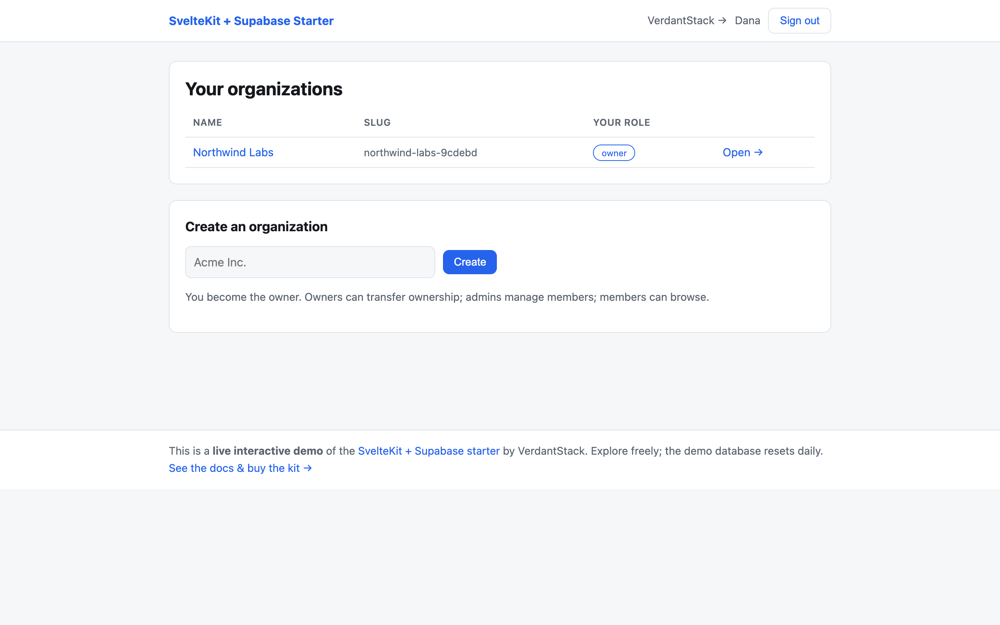
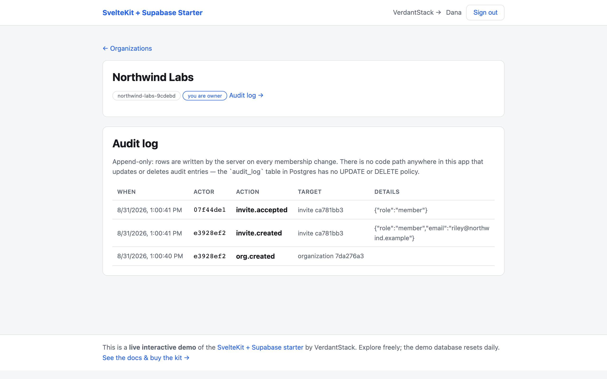
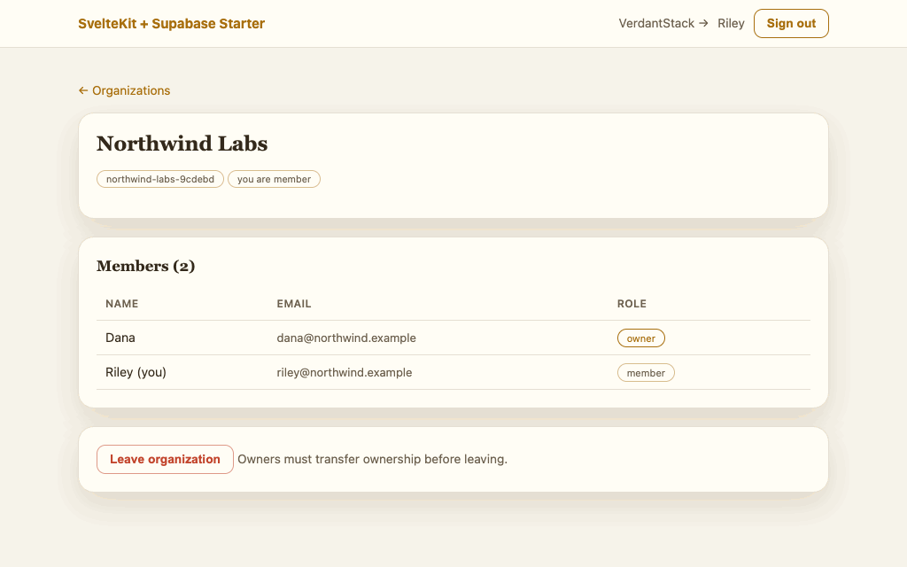
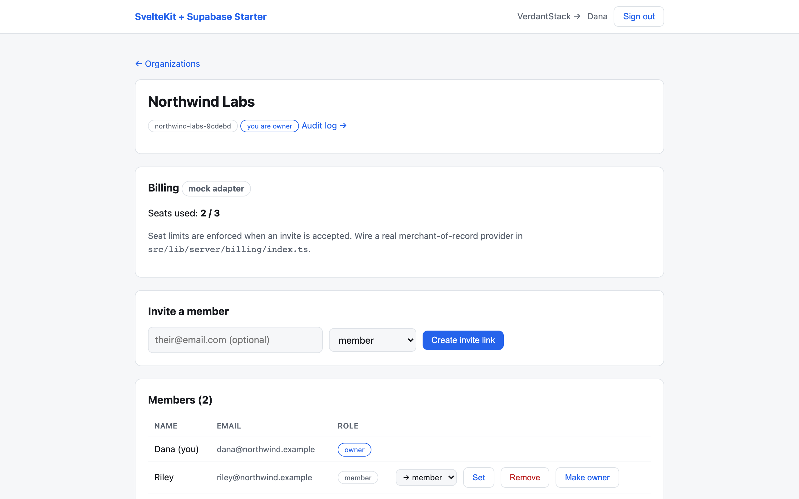
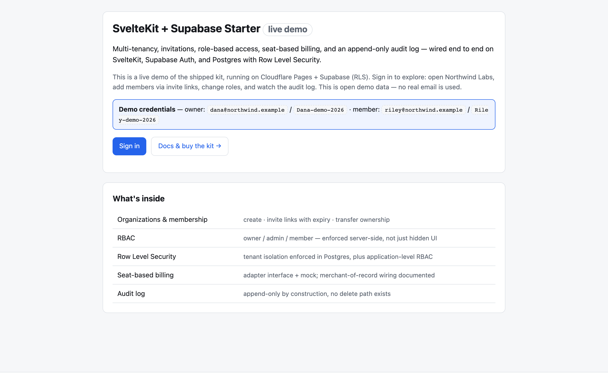
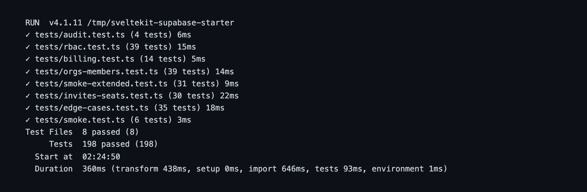

<p align="center">
  
</p>

<h3 align="center">SvelteKit + Supabase Starter</h3>

<p align="center">
  A production-grade B2B SaaS foundation for <strong>SvelteKit + Supabase</strong> with multi-tenancy wired end to end.
</p>

<p align="center">
  organizations & membership · invite links · role-based access control · seat-based billing · append-only audit log · Supabase RLS for tenant isolation · tested where it hurts.
</p>

<p align="center">
  <a href="https://verdantstack-site.pages.dev/products/sveltekit-supabase-starter/">Documentation & guides →</a>
</p>

---

> ## 🔒 Get the full source
>
> This repository showcases the **SvelteKit + Supabase Starter**: the feature
> list, architecture docs, and screenshots below. The complete production source
> code (RBAC, invites, seat billing, audit log, Supabase RLS) is included with
> your purchase.
>
> **Try the live demo → [supabase-starter.verdantstack-site.pages.dev](https://supabase-starter.verdantstack-site.pages.dev/)** — click through
> organizations, invites, RBAC, and the audit log for free.
>
> **[Buy the kit →](https://www.paypal.com/ncp/payment/TRHTAC76U2ECU)** — one-time
> license · 30-day refund · **lifetime updates + lifetime standard support**.
> Questions? [verdantstack@proton.me](mailto:verdantstack@proton.me)

---

<!-- Metadata for AI agents and tooling -->
<!--
project_name: sveltekit-supabase-starter
project_type: starter-kit
language: TypeScript
framework: SvelteKit
database: PostgreSQL (via Supabase)
auth: Supabase Auth
testing: Vitest
license: Proprietary
version: 0.2.1
status: production-ready
test_count: 75
changelog: https://github.com/verdantstack/sveltekit-supabase-starter/blob/main/CHANGELOG.md
releases: https://github.com/verdantstack/sveltekit-supabase-starter/releases
website: https://verdantstack-site.pages.dev/products/sveltekit-supabase-starter/
repository: https://github.com/verdantstack/sveltekit-supabase-starter
support_email: verdantstack@proton.me
support_patreon: https://www.patreon.com/cw/VerdantStack
features:
  - multi-tenancy
  - role-based-access-control
  - seat-billing
  - audit-log
  - supabase-rls
  - invite-links
tags: sveltekit, supabase, saas, starter, boilerplate, multi-tenant, rbac, billing, audit, rls
-->

## Status

**Version**: 0.2.1 | **Last Updated**: 2026-08-30 | **License**: Proprietary

[](CHANGELOG.md)
[](https://github.com/verdantstack/sveltekit-supabase-starter/releases)
[](https://www.patreon.com/cw/VerdantStack)
[](https://github.com/verdantstack/sveltekit-supabase-starter/blob/main/AGENTS.md)

- [x] Auth: Supabase Auth (email+password, magic links, OAuth)
- [x] Multi-tenancy: organizations with Supabase RLS for tenant isolation
- [x] Invites: single-use hashed tokens, 7-day expiry, revoke, atomic claim
- [x] RBAC: `owner > admin > member`, capability matrix + hierarchy rules enforced server-side
- [x] Billing: `BillingAdapter` interface + `MockBillingAdapter` (seat limits enforced at join time)
- [x] Audit log: append-only by construction (no UPDATE/DELETE path exists)
- [x] RLS policies: defense-in-depth tenant isolation at the database level
- [x] Tests: 198 tests — service-level (fake Supabase) + smoke, covering RBAC, orgs, invites, billing, audit
- [ ] Real MoR billing adapter (in progress — plugs into the same `BillingAdapter` seam)

## Why this exists

[FACT] CMSaasStarter has 2,357★ on GitHub proving demand for SvelteKit + Supabase starters. But it lacks multi-tenancy, RBAC, seat billing, and audit logging — the hard parts of any B2B SaaS.

This starter handles those hard parts so you can focus on your actual product.

## See it in action

Real UI captured from the **live deployed demo** — [supabase-starter.verdantstack-site.pages.dev/](https://supabase-starter.verdantstack-site.pages.dev/) (seeded org, resets daily; click through free, no login needed to explore):

| Organizations home — sign in, pick an org | Audit log — every event recorded, append-only |
|---|---|
|  |  |

### Role-based access control is enforced server-side — real session, ~3s

A member's view renders no admin controls; even a hand-crafted POST to promote the owner is rejected by the app with a real HTTP 403:



<details>
<summary>More screenshots (<code>docs/screenshots/</code>)</summary>

| Shot | Shows |
|---|---|
|  | Org dashboard — members, seats, invite controls |
|  | Demo landing — credentials callout + buy-kit CTA |
|  | Verbatim `npm test` output — 198 passing |

</details>

## Quick start

```bash
# Prerequisites: Node.js 18+, Supabase project (free tier works)
npm install
cp .env.example .env.local  # Add your Supabase credentials
npm run dev                  # http://localhost:5173
npm test                     # vitest suite
npm run check                # svelte-check
```

### Supabase setup

1. Create a free project at [supabase.com](https://supabase.com)
2. Run the migration in `supabase/migrations/0001_initial_schema.sql`
3. Copy your project URL and keys to `.env.local`

## Architecture

```
your +page.server.ts routes   → thin: parse form → call service → fail/redirect (you wire these)
        ↓
services (orgs/members/invites)  → domain logic, pure functions
        ↓
rbac.ts / billing/            → policy + payment seams
        ↓
supabase/client.ts            → Supabase client (service role for admin, user-scoped for RLS)
```

### Critical Rules

1. **Routes (yours, once wired) NEVER touch the database directly** — all writes go through services
2. **Services are framework-free** — import nothing from `@sveltejs/kit`
3. **Every mutating service call re-derives authority** — callers pass `actorRole`, fetched fresh inside the same request
4. **Errors carry machine codes** — `AuthError`, `RbacError`, `InviteError`, `MemberError`, `OrgError`, `BillingError`
5. **RLS provides defense-in-depth** — application code enforces RBAC, RLS enforces tenant isolation

## RBAC Model

**Roles:** `owner` (rank 2) > `admin` (rank 1) > `member` (rank 0)

**Hierarchy rules (enforced everywhere):**
1. Act downward only — `rank(actor) > rank(target)`
2. Grant strictly below yourself — `rank(actor) > rank(granted)`
3. No self-modification
4. Single-owner invariant — last owner cannot leave or be removed

**Capability matrix** (in `rbac.ts` `MATRIX`):
- `owner`: all permissions
- `admin`: org.view, members.view, members.invite, members.remove*, members.role.set*, invites.revoke, audit.view
- `member`: org.view, members.view

*subject to hierarchy rules

## Supabase RLS

Row Level Security policies provide defense-in-depth tenant isolation:

- Users can only see organizations they belong to
- Memberships are scoped to the user's organizations
- Invites are scoped to the user's organizations
- Audit logs are scoped to the user's organizations
- Service role bypasses RLS for admin operations

See `supabase/migrations/0001_initial_schema.sql` for the full policy definitions.

## Environment Variables

| Variable | Purpose |
|----------|---------|
| `PUBLIC_SUPABASE_URL` | Your Supabase project URL |
| `PUBLIC_SUPABASE_ANON_KEY` | Your Supabase anonymous key |
| `PRIVATE_SUPABASE_URL` | Your Supabase project URL (server only) |
| `PRIVATE_SUPABASE_ANON_KEY` | Your Supabase anon key (server only; user-scoped clients) |
| `PRIVATE_SUPABASE_SERVICE_ROLE_KEY` | Your Supabase service role key (server only) |
| `MOCK_PLAN_SEATS` | Seat limit for MockBilling (default: 3) |

## Testing

- **Framework:** Vitest
- **Runtime:** service-level tests run against an in-memory fake Supabase client — no database needed
- **RLS-level checks:** `supabase start` (see `docs/testing.md`)
- **Run:** `npm test` (198 tests)

### Test Files
| File | Coverage |
|------|----------|
| `tests/rbac.test.ts` | Matrix pinning, hierarchy rules |
| `tests/orgs-members.test.ts` | Org CRUD, membership management, role hierarchy, transfer invariants |
| `tests/invites-seats.test.ts` | Invite lifecycle, atomic single-use claim, expiry/revoke, seat limits |
| `tests/billing.test.ts` | Mock adapter contract, seat boundaries, env override |
| `tests/audit.test.ts` | Append-only audit writer, metadata serialization |
| `tests/smoke.test.ts` | Build verification, constants, adapter instantiation |

## Choose your data layer

This starter pairs SvelteKit with **Supabase** (PostgreSQL). The same kit is also available with a self-hosted **SQLite** data layer. The table below compares the two data-layer options.

| Feature | SQLite edition | Supabase edition (this repo) |
|---------|------------------------------|--------------------------------|
| Database | SQLite (better-sqlite3 + Drizzle) | PostgreSQL (via Supabase) |
| Auth | Custom scrypt + sessions | Supabase Auth |
| Multi-tenancy | Application-level | RLS + application-level |
| Realtime | Not included | Supabase Realtime |
| Hosting | Any (Cloudflare Workers, Vercel, etc.) | Supabase-hosted database |
| Best for | Self-contained, zero-dependency | Managed infrastructure, realtime features |

## Versioning & Releases

**Standing Rule:** Releases are cut by the VerdantStack release pipeline (bump → changelog → tag → public release) — this repo has no `npm run release`. Merges must keep the tree green:

```bash
npm test               # 198 tests
npm run check          # svelte-check
npm run build          # production build
npm run docs:api:check # API reference in sync (typedoc)
```

See [CHANGELOG.md](CHANGELOG.md) for change history and [docs/versioning.md](docs/versioning.md) for the full process.

## License

The full source is included with your purchase under the
[End User License Agreement](https://verdantstack-site.pages.dev/docs/license/).

**[Buy the kit →](https://www.paypal.com/ncp/payment/TRHTAC76U2ECU)**

30-day refund policy. Contact: verdantstack@proton.me

---

<p align="center">
  Built by <a href="https://github.com/verdantstack">VerdantStack</a>
</p>

<p align="center">
  <sub>Like this project? <a href="https://www.patreon.com/cw/VerdantStack">Support us on Patreon</a> for $5/month.</sub>
</p>
