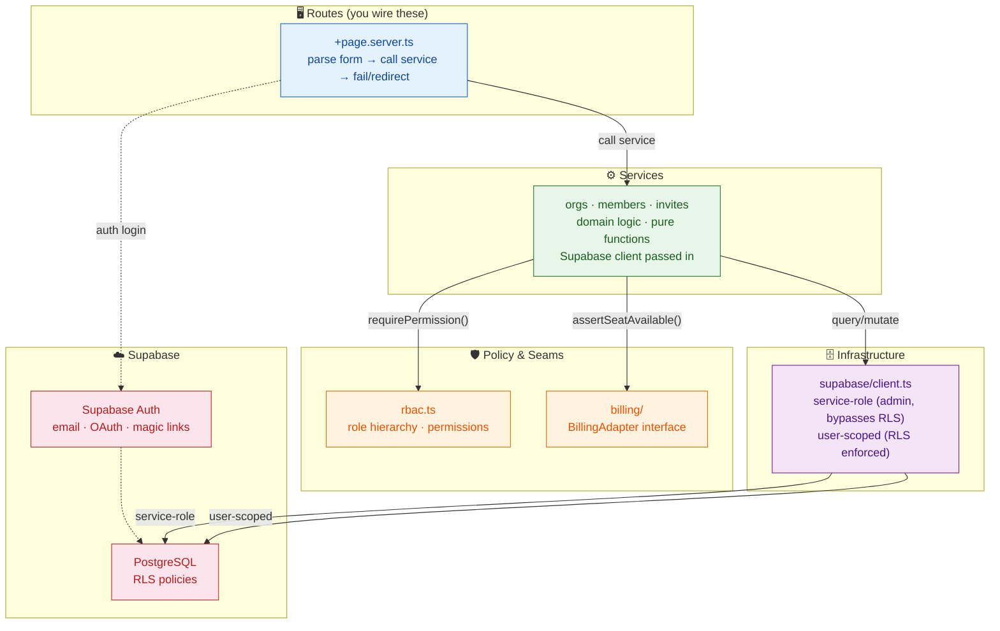
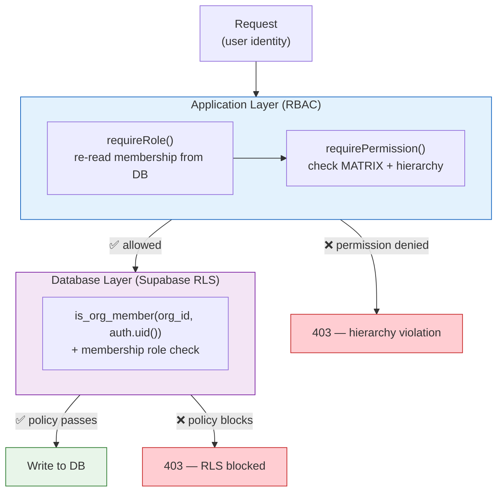

# Architecture

## Layering

Rules:

1. **Routes never touch the database directly** — all writes go through a service so audit entries and permission checks can't be skipped.
2. **Services are framework-free** — they import nothing from `@sveltejs/kit`. That's what makes them unit-testable against an in-memory fake Supabase client with no runtime and no database.
3. **Every mutating service call re-derives authority from arguments**: callers pass `actorRole`, fetched fresh inside the same request. No trust in client-submitted role fields.
4. **Errors carry machine codes** (`AuthError`, `RbacError`, `InviteError`, `MemberError`, `OrgError`, `BillingError`). Map them to HTTP responses in exactly one place per app (the route layer).

## Concurrency notes

- **Single-use invites** don't rely on read-then-write. Acceptance performs an `UPDATE` whose `WHERE` clause is the concurrency gate (`.eq('id', id).is('accepted_at', null).is('revoked_at', null)`), then reads back the claimed row. Zero rows claimed = someone got there first. Safe under concurrent clicks without explicit transactions.
- **Seat counting** is a `COUNT` over memberships performed inside `acceptInvite` before the single-use claim, so a full org never claims an invite it can't honor.

## Sessions & auth

- Authentication is **Supabase Auth** (email+password, magic links, OAuth). Sessions live in Supabase, not your database.
- Service-side operations use the **service-role client** (`createServerClient`) to bypass RLS for admin writes (audit entries, seat checks).
- User-scoped operations use `createUserClient(accessToken)` so RLS applies to that user's rows.
- Never hand a service-role client to the browser. `PRIVATE_*` env vars are server-only.

## RBAC + RLS (defense in depth)

- **Application code enforces RBAC** on every mutating call (`requirePermission()` + hierarchy checks in `members.ts` / `invites.ts`).
- **RLS enforces tenant isolation** at the database level (`is_org_member`, `get_org_role`, `has_min_role` helpers in the migration): a user can only see organizations they belong to, and only owners/admins can mutate membership and invite rows.
- The two layers verify each other: app-level tests prove the business rules; a locally running Supabase (`supabase start`) proves the policies. See `docs/testing.md`.

## Audit design

`audit_log.org_id`/`actor_user_id` are plain columns (no FK) so history survives member removal and (future) org deletion. Metadata is a JSON string; writers decide what goes in. The raw invite token is never audited. There is **no UPDATE or DELETE policy** on `audit_log` — append-only by construction at both the schema and the application layer.

## Environment variables

| Variable | Purpose |
|----------|---------|
| `PUBLIC_SUPABASE_URL` | Your Supabase project URL (shared with the browser) |
| `PUBLIC_SUPABASE_ANON_KEY` | Supabase anonymous key (shared with the browser) |
| `PRIVATE_SUPABASE_URL` | Supabase project URL — **server only** |
| `PRIVATE_SUPABASE_ANON_KEY` | Supabase anon key — **server only** (user-scoped clients) |
| `PRIVATE_SUPABASE_SERVICE_ROLE_KEY` | Service-role key — **server only**, bypasses RLS |
| `MOCK_PLAN_SEATS` | Seat limit for `MockBillingAdapter` (default 3) |

## Swapping the billing provider

All payment knowledge sits behind `BillingAdapter` (`docs/billing.md`). Swapping the merchant of record changes one wiring function — no service or route changes.

## Deliberate limits

- `acceptInvite` counts seats via the passed `billing` adapter; the shipped mock enforces `MOCK_PLAN_SEATS`. A real adapter must read seats from a `subscriptions` table updated by webhooks.
- Invite links work for whoever holds them; the optional `email` field is a human note, not enforcement. Email-enforced invites need email delivery, which needs an account (out of scope).
- RLS policies are shipped in the migration but are only fully exercised when you run a real Supabase instance (`supabase start`) — the unit suite tests application-level enforcement with a fake client.