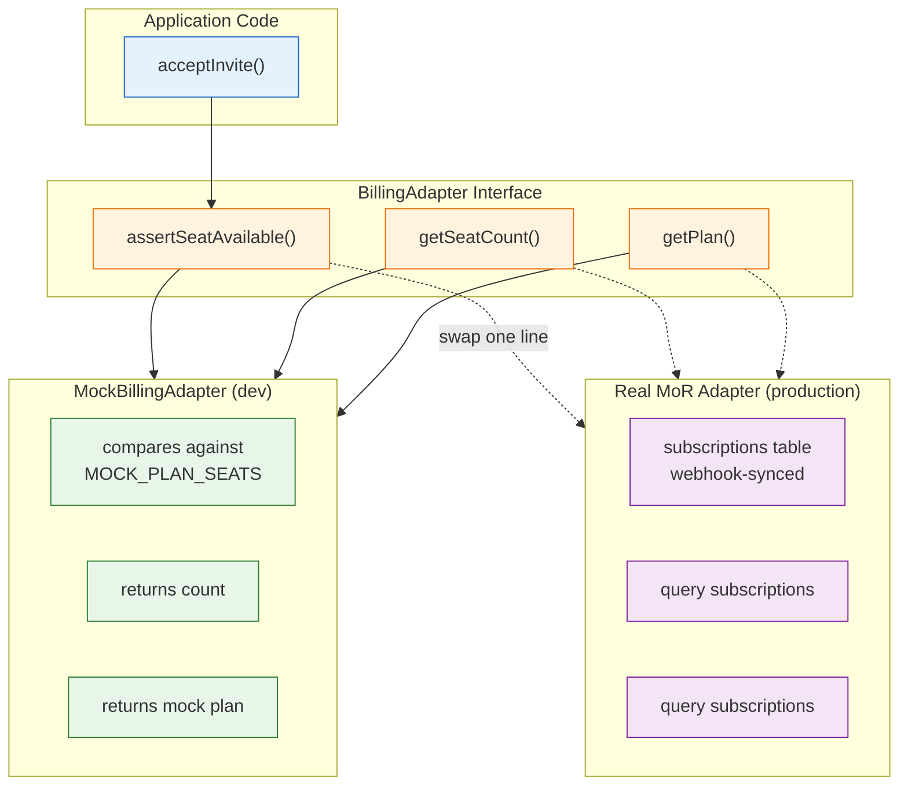
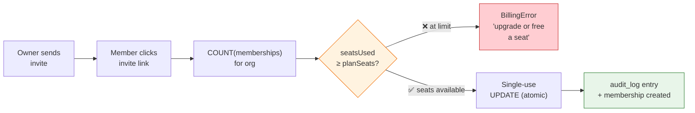

# Billing wiring (seat-based, merchant-of-record)

## Why an adapter



Checkout runs through a **Merchant of Record** (Lemon Squeezy / Paddle / Payhip are the usual candidates): the MoR becomes the legal seller of record and handles sales tax, so you don't register as a merchant in every jurisdiction your customers live in. Which MoR you pick is swappable by design — the product must not depend on that choice, so all payment knowledge sits behind:

```ts
// src/lib/server/billing/adapter.ts
export interface BillingAdapter {
	assertSeatAvailable(orgId: string, currentMemberCount: number): Promise<void>;
	getSeatCount(orgId: string): Promise<number>;
	getPlan(orgId: string): Promise<{ planId: string; seatLimit: number }>;
}
```

Everything else in the codebase consumes the interface. Today it's satisfied by `MockBillingAdapter` (`MOCK_PLAN_SEATS` seats, default 3). Wiring point: `src/lib/server/billing/mock.ts` `createBillingAdapter()` — swap one function, change nothing else.

## Where enforcement happens



Exactly one gate: **invite acceptance** (`acceptInvite`). The service counts current memberships for the org and calls `assertSeatAvailable(orgId, count)` before the single-use claim. Inviting beyond the seat count is allowed on purpose — the limit surfaces at accept time as an actionable error ("upgrade or free a seat"), which is also how most incumbents behave and what beta testers expect to see.

Counting rule v0.1: `seatsUsed = COUNT(memberships)` for the org.

## What the real adapter must do

1. `assertSeatAvailable`: compare `currentMemberCount` (passed by the caller) against the org's plan seat limit; throw `BillingError('seat_limit', …)` when full.
2. `getSeatCount`: return the org's current seat usage (for admin screens and pre-flight checks).
3. `getPlan`: return the org's plan id + seat limit from a `subscriptions` table keyed by orgId and kept in sync by MoR webhooks.
4. Webhook endpoint (new route, outside auth guard): verify signature → update the local subscription row. Never trust client-side success redirects for entitlements.
5. Keep `MockBillingAdapter` as the default under `NODE_ENV=development` so tests/dev stay hermetic.

## Error contract

`BillingError` carries machine codes (`seat_limit` | `no_plan` | `adapter_error`). The service layer translates `seat_limit` into a clear, actionable rejection at invite-accept time — never a silent drop.