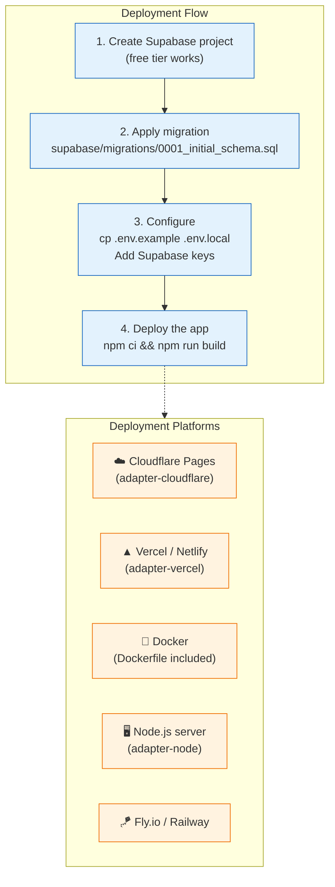
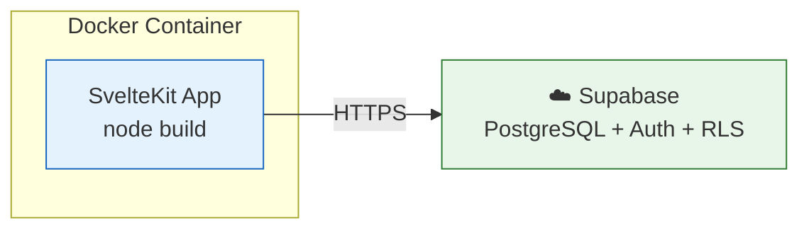

# Deployment

This kit is a SvelteKit application that connects to **Supabase** (managed PostgreSQL + Auth + RLS). Deploy the app anywhere SvelteKit runs, point it at your Supabase project, done.



## 1. Quick start (local)

```bash
npm install
cp .env.example .env.local    # Add your Supabase credentials
npm run dev                   # http://localhost:5173
```

## 2. Supabase setup

1. Create a free project at [supabase.com](https://supabase.com)
2. Run the migration in `supabase/migrations/0001_initial_schema.sql` (via SQL Editor or Supabase CLI)
3. Copy your project URL and keys to `.env.local`

### Environment variables

| Variable | Purpose |
|----------|---------|
| `PUBLIC_SUPABASE_URL` | Your Supabase project URL |
| `PUBLIC_SUPABASE_ANON_KEY` | Your Supabase anonymous key |
| `PRIVATE_SUPABASE_URL` | Your Supabase project URL (server only) |
| `PRIVATE_SUPABASE_ANON_KEY` | Your Supabase anon key (server only; user-scoped clients) |
| `PRIVATE_SUPABASE_SERVICE_ROLE_KEY` | Your Supabase service role key (server only) |
| `MOCK_PLAN_SEATS` | Seat limit for MockBilling (default: 3) |

## 3. Deploy with Docker

A `Dockerfile` and `docker-compose.yml` are included for container deployments.

```bash
# Create .env with your Supabase credentials
cp .env.example .env
# Edit .env with your Supabase keys

# Build and run
docker compose up -d        # start on http://localhost:5173
docker compose logs -f      # follow logs
docker compose down         # stop
```

### How it works



The app connects to your Supabase project over HTTPS. No local database needed — Supabase handles storage, auth, and RLS.

## 4. Deploy to Cloudflare Pages

```bash
# 1. Pin the adapter
npm install -D @sveltejs/adapter-cloudflare

# 2. Update vite.config.ts
import adapter from '@sveltejs/adapter-cloudflare';
adapter()

# 3. Deploy
npx wrangler pages deploy build
```

Set Supabase credentials in the Cloudflare Pages dashboard (Settings → Environment variables).

## 5. Deploy to Vercel / Netlify

```bash
# 1. Pin the adapter
npm install -D @sveltejs/adapter-vercel   # or adapter-netlify

# 2. Update vite.config.ts
import adapter from '@sveltejs/adapter-vercel';
adapter()

# 3. Deploy via Git integration or CLI
npx vercel --prod
```

Set Supabase credentials in the Vercel dashboard (Settings → Environment Variables).

## 6. Deploy to a VPS (Node.js server)

```bash
# On your server
git clone <repo-url> && cd sveltekit-supabase-starter
npm ci
npm run build

# Set environment variables
export PUBLIC_SUPABASE_URL=https://your-project.supabase.co
export PUBLIC_SUPABASE_ANON_KEY=your-anon-key
export PRIVATE_SUPABASE_URL=https://your-project.supabase.co
export PRIVATE_SUPABASE_ANON_KEY=your-anon-key
export PRIVATE_SUPABASE_SERVICE_ROLE_KEY=your-service-role-key

# Run with a process manager
npx pm2 start build --name supabase-starter
# or
npm run start   # if using adapter-node
```

## 7. Deploy to Fly.io / Railway

```bash
# Fly.io
fly launch
fly deploy

# Railway
# Connect your Git repo — Railway auto-detects Node.js
```

Set Supabase credentials in the platform's environment config.

## 8. Production checklist

- [ ] Supabase project is on a paid plan (or aware of free tier limits)
- [ ] RLS policies are enabled (defense-in-depth; see `supabase/migrations/`)
- [ ] Replace `MockBillingAdapter` with a real billing provider (see `docs/billing.md`)
- [ ] Enable HTTPS (reverse proxy with Caddy/Nginx, or use a platform that provides it)
- [ ] Set up Supabase database backups (included in Supabase Pro plan)
- [ ] Monitor Supabase usage (dashboard → Database → Statistics)
