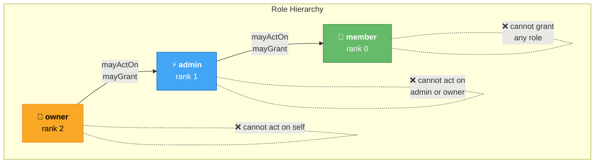
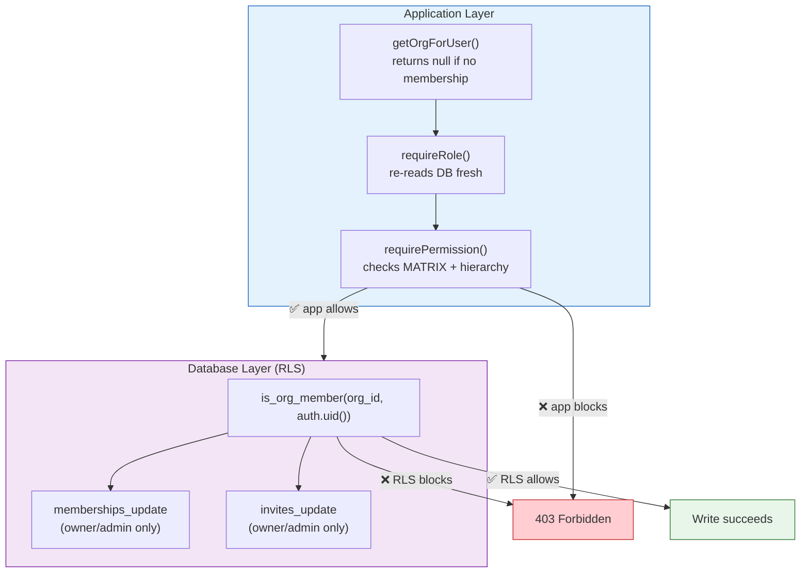

# RBAC model

## Roles

`owner > admin > member` (rank 2 > 1 > 0)

## Capability matrix

| Permission | owner | admin | member |
|---|:-:|:-:|:-:|
| org.view | ✓ | ✓ | ✓ |
| org.update | ✓ | — | — |
| org.delete | ✓ | — | — |
| members.view | ✓ | ✓ | ✓ |
| members.invite | ✓ | ✓ | — |
| members.remove | ✓ | ✓* | — |
| members.role.set | ✓ | ✓* | — |
| invites.revoke | ✓ | ✓ | — |
| audit.view | ✓ | ✓ | — |
| billing.manage | ✓ | — | — |
| ownership.transfer | ✓ | — | — |

\* subject to hierarchy rules below.

The matrix lives in exactly one place: `src/lib/server/rbac.ts` (`MATRIX`). UI gating is cosmetic only; every gate re-checks the matrix server-side.

## Hierarchy rules (the part buyers get wrong)

Enforced in `members.ts` / `invites.ts` on every action:

1. **Act downward only** — `mayActOn(actor, target)` requires `rank(actor) > rank(target)`. An admin cannot touch another admin or the owner.
2. **Grant strictly below yourself** — `mayGrant(actor, granted)` requires `rank(actor) > rank(granted)`. Only owners mint admins; admins mint members. Nobody grants their own rank, ever.
3. **No self-modification** — you cannot change your own role, remove yourself via remove-member (use *Leave*), or transfer ownership to yourself.
4. **Single-owner invariant** — `transferOwnership` sets target→owner and actor→admin together; leaving while still the sole owner is refused (`last_owner`).

## Enforcement points

Two independent layers:

- **Application layer** — page loads call `getOrgForUser()` and get `null` unless the caller has a membership row; capability-gated reads re-check the matrix on top of membership. Actions re-read the membership fresh per request, then run `requirePermission()` + hierarchy checks before any write. Forging requests with another user's role field fails; only the session identity matters, and capabilities derive from database state.
- **Database layer (RLS)** — the shipped migration enables Row Level Security and scopes every read to `is_org_member(org_id, auth.uid())`. Owners/admins get `memberships_update`/`invites_update`; writes that application code refuses are also refused by policy, so a bug in one layer does not leak tenant data.

## Test coverage

`tests/rbac.test.ts` pins the matrix; `tests/orgs-members.test.ts` and `tests/invites-seats.test.ts` prove the hierarchy end-to-end against an in-memory fake Supabase client, including every attempt that must fail; `tests/smoke.test.ts` sanity-checks the rolling build. RLS policies themselves are verified when running against a real Supabase instance (`supabase start`, see `docs/testing.md`).